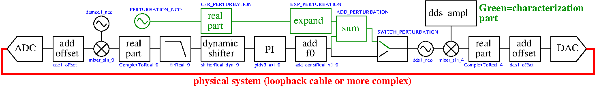

# DigitalPLLCharacterization

The objective of this set of gateware and software is to characterize the transfer
function of a digital proportionnal-integrator (PI) controller. The experimental
setup uses a 14-bit or 16-bit Redpitaya with a loopback cable between DAC1 and ADC1.
The software application (app/main.c) sweeps a perturbation signal generated by a
Numerically Controlled Oscillator (NCO) and for each frequency, a binary file is stored
in /tmp with the perturbation signal and the corrected output (raw, medium low pass filtering
and strong low pass filtering). Postprocessing on the host PC uses the GNU Octave/Matlab
script found in analysis/ for displaying the transfer function.




## Results


## Project synthesis and compilation

On the host PC where OscimpDigital is installed:
```
cd /somewhere/oscimpDigital                      # goto OscimpDigital repository
source settings.sh                               # set environment variables
source /opt/Xilinx/Vivado/2020.1/settings64.sh   # load Vivado environment variables 
cd /somewhere/DigitalPLLCharacterization/design  # go to this design
make                                             # Vivado synthesis ... very long
make xml                                         # get resources from Vivado project
cd ..                                            # vvv generate app/ bash script
${OSCIMP_DIGITAL_APP}/tools/module_generator/ *.xml
${OSCIMP_DIGITAL_APP}/tools/webserver_generator/webserver_generator.py *.xml
cd app
make                                             # compile application
```

The Redpitaya Buildroot install is expected to include the Oscimp libraries: copy from OscimpDigital/lib
liboscimp_fpga.so to the Redpitaya's /usr/lib

On the Redpitaya
```
cd app
./double_iq_pid_vco_charac_us.sh                 # load bitstream and kernel modules
./double_iq_pid_vco_charac_us                    # execute the PLL characterization program, filling /tmp with *.bin
```
